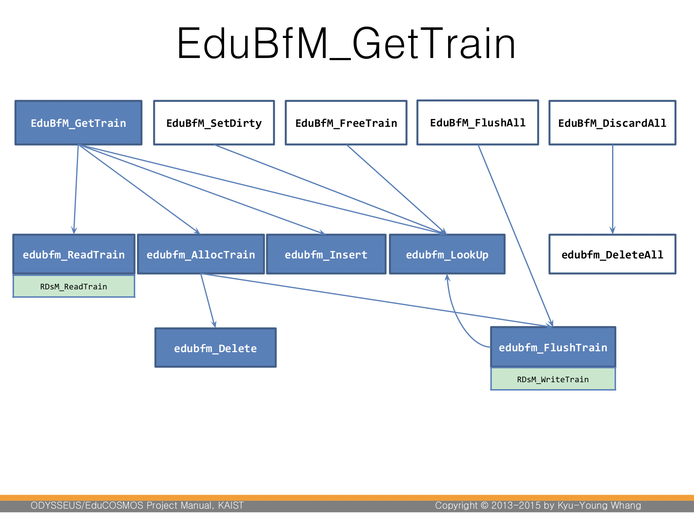

# EduBfM Report

Name: koheeju

Student id: 20170252

# Problem Analysis

디스크의 페이지가 메인 메모리에 올라오면 프레임에 할당된다. 모든 프레임이 사용중이라면 비어있는 대상 프레임을 확보해줘야 한다. 이때 희생자 프레임(victim frame)을 선택해야 한다. 프레임에 있는 페이지가 더티라면 디스크에 저장하고 아니라면 프레임만 비운다. 
이때 어떤 프레임을 선택할 것인지 결정해야 한다. 
프레임 교체 알고리즘에는 LRU, 클락버퍼교체 알고리즘이 있다.
LRU는 가장 오래동안 안 쓰인 프레임을 교체한다.
클락버퍼교체 알고리즘은 clock pointer가 있고 포인터가 프레임을 돌아가며 가리킨다. 각 프레임은 기본적으로 클락비트를 가지고 있고 초기에 1로 초기화된다. 포인터가 가리켰을 때 1이라면 0으로 바꾸고 0이라면 해당 프레임을 교체한다. 교체한 후 클락포인터는 다음 프레임을 가리킨다.
이러한 방식으로 버퍼매니저가 메인메모리상의 페이지를 관리하게된다. 

참조 중인 페이지에 대해서는 FIX하고 그 수를 비트로 나타낸다.
# Design For Problem Solving
다루어야 할 데이터는 총 5가지이다. 
bufinfo, bufferPool, BfMHashKey, hashTable, bufTable

bufinfo은 bufferPool, hashTable, bufTable를 가리키는 포인터, 다음 희생자 프레임, bufferPool의 element들의 크기, element개수를 데이터로 가지고 있다. 
bufferPool은 element를 저장하는 배열이다.
bufTable은 hashTable의 키, 해당 element를 참조하고 있는 transaction의 수, 더티비트, 방문여부 비트를 가지는 bits, 동일 해쉬 키값을 갖는 다음 배열 인덱스를 데이터로 가지고 있다.
bfm은 해쉬키 값을 가지고 있다.
hashTabled은 해당 키값에 대한 배열 인덱스를 가지고 있다.

이 데이터구조를 가지고 버퍼매니저를 구현하면 된다.
## High Level

위의 그림은 구현할 함수들의 관계도이다. 

# EduBfm_GetTrain()
bufferPool에 페이지가 있다면 Fix하고 해당페이지의 element의 포인터를 반환한다. 참조하고 있다는 것을 나타내는 Fix값을 1 늘리고 REFER 비트를 1로 한다. 
만약 페이지가 없다면 bufferPool에 element를 추가한다. 참조 수, REFER를 1로 초기화한다. 

# EduBfm_FreeTrain()
참조하고 있는 수를 1감소 시킨다.

# EduBfm_SetDirty()
페이지가 변경 됐다면 더티비트가 1로 세팅된다. 해당 페이지의 더티비트를 1로 초기화 시킨다.

# EduBfm_FlushAll()
bufferPool에 있는 페이지들 중 더티비트가 1인 것 전부를 디스크에 쓴다.

# EduBfm_DiscardAll()
bufferPool에 있는 모든 페이지들을 삭제한다. 더티비트와 상관없이 디스크에 작성하지 않고 삭제한다. 

# edubfm_ReadTrain()
디스크에서 페이지를 읽어들인다. 이미 제공되는 함수가 있다. RDsMReadTrain 함수를 활용한다.
# edubfm_AllocTrain()
페이지를 저장하기 위해 bufferPool에 할당하는 함수이다. REFER비트가 1이라면 0으로 바꾸고 0이라면 교체한다. 클락버퍼교체 알고리즘과 동일하다. 이때 더티비트가 1이면 디스크에 작성한다. 
# edubfm_Insert()
배열 인덱스를 해쉬테이블에 저장한다. 만약 충돌이 없다면 해당 위치에 저장하고 충돌이 일어난다면 chaining method를 활용하여 다음 위치에 저장한다.

# edubfm_Delete()
해쉬테이블에서 인덱스를 제거한다.
# edubfm_Deleteall()
해쉬테이블 모두 삭제한다.
# edubfm_LookUp()
해쉬 키값을 이용하여 배열 인덱스를 찾아낸다.
# edubfm_FlushTrain()
변경된 페이지를 디스크에 작성한다.

# Mapping Between Implementation And the Design
위의 개념을 이해하고, ppt슬라이드에 나와있는 자세한 사항을 참조하여 구현하면 된다. 직접적으로 DB를 구현하는 것이 아니고 데이터베이스에서 버퍼매니저가 하는 역할을 이해하고 쓰이는 Policy를 이해하고 구현을 하면 된다. API를 작성하는 것이고, 매크로가 잘 구현 돼있어 세부적인 디테일을 알 필요가 없다(알 수도 없다).
